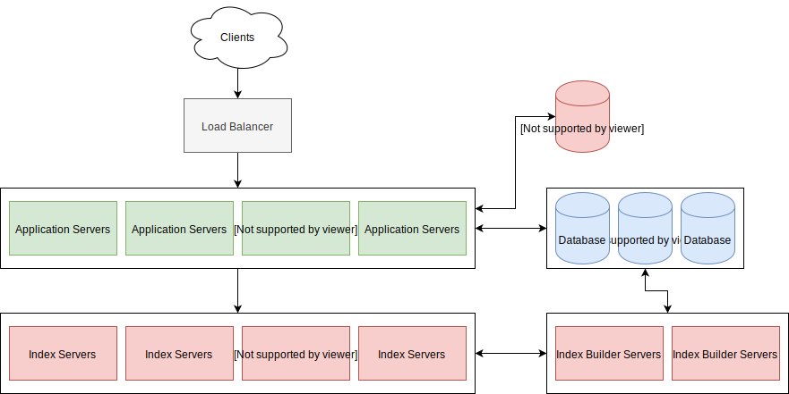

# scalable-twitter-search
A walkthrough of how to do full-text search at Twitter's scale. 

This is the first installment of tutorial series that aims to explain practical distributed system techniques through examples of real-world architecture. This project includes a detailed walkthrough of designing the architecture from the group up and a barebones implementation of the architecture so you can poke, prod, and explore how it works. 


Some expectations around the barebones implementation: 

- The focus is on the architecture behind this implementation. To highlight and most easily deliver the notion of how it works; the implementation intentionally ignores the best practice minutiae of implementing a system like this in production. For example, there's no validation on client input, and the MySQL driver is used directly rather than an ORM to make it clear what queries are being issued. 
- The implementation is in Node.js to make it as approachable and readable by as many developers as possible. Most programmers have some exposure to JavaScript, and for those that don't; they'll find the syntax familiar and easy to read. 
- The implementation's local deployment will be scaled down from the production scale the walkthrough outlines so it's possible to run on a laptop. 

Here's a sneak peak of what we'll be building: 



## Requirements of the system
Our goal is to build a system where users can search for tweets. 

Context: 
- Twittter has 140M daily active users.<sup>[1]</sup>
- users create 500M tweets per day.<sup>[1]</sup>
- The average size of a tweet is 33 characters.<sup>[2]</sup>
- We'll asssume 600M searches for tweets per day. 

[1]:https://www.omnicoreagency.com/twitter-statistics/
[2]:https://techcrunch.com/2018/10/30/twitters-doubling-of-character-count-from-140-to-280-had-little-impact-on-length-of-tweets/

### Functional Requirements

- Users should be able to create tweets.
- Users should be able to search for tweets by query. 
- Tweet content will be restricted to [280 characters](https://techcrunch.com/2018/10/30/twitters-doubling-of-character-count-from-140-to-280-had-little-impact-on-length-of-tweets) of text.

### Non-Functional Requirements

- The system needs to be highly available. 
- The system should be highly reliable. Tweets created by users should never be lost.
- The accepatble latency for search results is 200ms.

## Capacity Estimation

### Storage Capacity: 

We have 500M new tweets each day. Given that the average tweet is 33 charcters long, we can estimate a conservative average tweet size of 134 bytes. We caclacuated that by mulipying the character length by the character encoding's byte size per encoded chacter. We need to use the character encoding `utf8mb4` to support the emoji's used in tweets. `utf8mb4` uses up to [4 bytes](https://dev.mysql.com/doc/refman/8.0/en/charset-unicode-sets.html) to encode each character. Lastly we add [two bytes](https://dev.mysql.com/doc/refman/8.0/en/storage-requirements.html#data-types-storage-reqs-innodb) to account of the overhead of storing text in mysql. 

```
134 bytes * 500M tweets = 67000000000 bytes or 67 GBs of new data in tweets per day
67GB * 365 days = 24.445 TB per year 
```
Thats a huge amount of data. The largest mysql instance you can create on aws can only hold [16TB](https://aws.amazon.com/about-aws/whats-new/2017/08/amazon-rds-for-sql-server-increases-maxiumum-database-storage-size-to-16-tb/). This means that we must use a distrubuted system. 

## High-Level Design

## Detailed Design 

### Storage

### Index


## Caching

## Running the implementation

Perquisites: 

- [Docker](https://www.docker.com/products/docker-desktop)

Bring up the implementation:

`docker-compose up`

Add your own tweets:

```
docker exec -it <application container id> bash
node scripts/load-tweets.js tweet-csv-data/tweets.csv
```

Or: 

```
curl -d '{"content": "My first tweet!"}' -H "Content-Type: application/json" -X POST http://localhost:3000/tweets
```

Search for tweets: 

```
curl  http://localhost:3000/tweets?query=tweet
```
